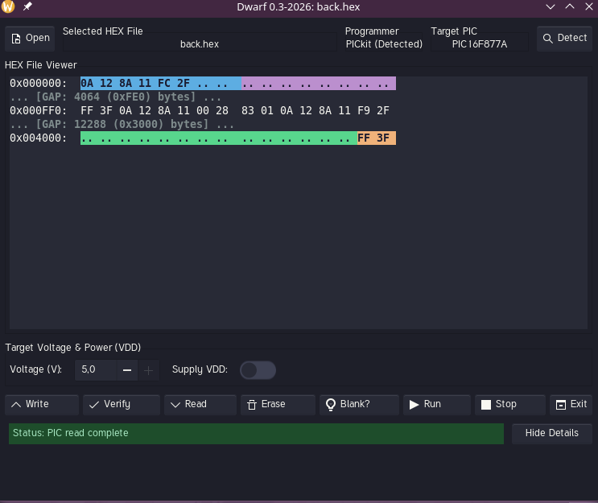

# DWARF2026: A Modern restyled GUI for pk2cmd in Linux

## Screenshot



Dwarf is a graphical interface for `pk2cmd`, designed to program Microchip PIC microcontrollers using the Microchip Pickit programmer.

Originally a simple Python script, Dwarf has been heavily modernized in **2026** to provide a robust, modern development experience on Linux while retaining its easy-to-use nature. It automates common tasks with the PICkit 2 and Pickit 3 , removing the need to memorize lengthy command-line arguments.

## 2026 Modernization Updates

The project has been completely overhauled to use modern technologies and provide an enhanced user experience:

### Technology Stack
*   **Python 3:** Fully migrated to modern Python.
*   **GTK 3 & PyGObject:** The UI has been rewritten using modern GTK 3 bindings, ensuring compatibility with current Linux desktop environments.
*   **pk2cmd Compatibility:** Updated to work seamlessly with the modern, community-maintained versions of `pk2cmd` available on GitHub.

### Visual & Functional Enhancements
*   **Interactive HEX Viewer:** A built-in, scrollable HEX file viewer. It features an intelligent parser that identifies memory regions (Reset Vector, Interrupt Vector, Config Words, EEPROM) and highlights them.
*   **Hover Tooltips:** Hovering over any byte in the HEX viewer reveals a floating tooltip with its physical address and memory region name.
*   **Theme Awareness:** The application dynamically adapts to your system's GTK theme (Light or Dark mode). The HEX viewer's syntax highlighting and the status bar automatically adjust to ensure perfect readability and contrast.
*   **Integrated Details Panel:** The status and operation details are now seamlessly integrated into the main window via a toggleable bottom panel, replacing the old, intrusive pop-up dialogs.
*   **Modern Iconography:** Buttons have been updated to use modern GTK symbolic icons combined with text labels, guaranteeing visibility across all system themes and ensuring actions are clear and intuitive.

## Requirements

*   Python 3.x
*   PyGObject (`python3-gi`)
*   GTK 3
*   `pk2cmd` (Ensure you have a modern build from GitHub installed and accessible in your system's PATH)

## Usage

Simply run the script:
```bash
./dwarf
```
